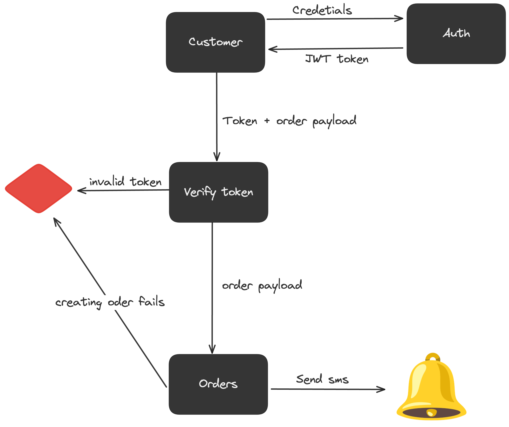

# Go REST Service for Customers and Orders

This Go project is a RESTful API service designed to manage customers and orders, with authentication using JWT tokens. It also includes SMS notifications for new orders.
## Features

- **Create Customer**: It is just signup using name,email, and password
- **Authentication**: JWT-based authentication for secure access.
- **Orders Management**: Create and read orders.
- **SMS Notifications**: Sends SMS alerts to customers for new orders.
- **CI/CD Pipeline**: Automated testing, deployment.
- **Deployment**: Hosted on Heroku for easy access and scalability.

## Usage
Basicaly test the API here

[](https://app.getpostman.com/run-collection/14705923-79b04e4e-a0f9-4d72-858f-85fcaa364df5?action=collection%2Ffork&source=rip_markdown&collection-url=entityId%3D14705923-79b04e4e-a0f9-4d72-858f-85fcaa364df5%26entityType%3Dcollection%26workspaceId%3Dffe4c664-7661-4b09-8f44-bd8977cae083#?env%5BProd%5D=W3sia2V5IjoiVVJJIiwidmFsdWUiOiJodHRwczovL29kZXJzLWFwaS02YmNiOGQ0OTkzNjcuaGVyb2t1YXBwLmNvbS9hcGkvIiwiZW5hYmxlZCI6dHJ1ZSwidHlwZSI6ImRlZmF1bHQiLCJzZXNzaW9uVmFsdWUiOiJodHRwczovL29kZXJzLWFwaS02YmNiOGQ0OTkzNjcuaGVyb2t1YXBwLmNvbS9hcGkvIiwic2Vzc2lvbkluZGV4IjowfSx7ImtleSI6IlRPS0VOIiwidmFsdWUiOiJleUpoYkdjaU9pSklVekkxTmlJc0luUjVjQ0k2SWtwWFZDSjkuZXlKbGJXRnBiQ0k2SW1wdmFHNWtiMlZBWjIxaGFXd3VZMjl0SWl3aVpYaHdJam94TnpBNE5qYzNNall5TENKcFpDSTZOeXdpY0dodmJtVWlPaUlyTWpVME56azBPVGM1TVRjMUluMC41YjU1Um50QXZfU1lFeWZaS25adlNnWlFCcDdfeHVKSU9JOVNrVk94ck93IiwiZW5hYmxlZCI6dHJ1ZSwidHlwZSI6ImRlZmF1bHQiLCJzZXNzaW9uVmFsdWUiOiJleUpoYkdjaU9pSklVekkxTmlJc0luUjVjQ0k2SWtwWFZDSjkuZXlKbGJXRnBiQ0k2SW1wdmFHNWtiMlZBWjIxaGFXd3VZMjl0SWl3aVpYaHdJam94TnpBNE5qYzNNall5TENKcFpDSTZOeXdpY0dodmJtVWlPaUlyTWpVME56azBPVGM1TVRjMS4uLiIsInNlc3Npb25JbmRleCI6MX1d)

